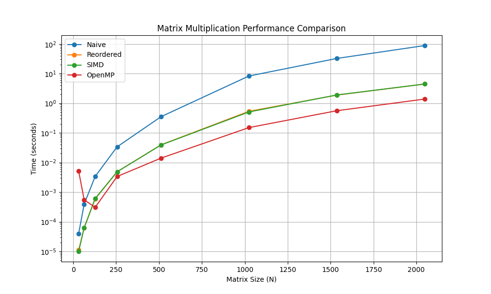

I recently decided to take on a challenge: building a Transformer architecture (the brain behind LLMs) completely from scratch in C. No PyTorch, no TensorFlow, just raw memory management and pointers.

My goal was to demystify the "black box." But very quickly, I ran into a wall. The core operation of a Transformer—Self-Attention—is essentially a series of massive matrix multiplications. If your `matmul` function is slow, your model is dead in the water.

So, I took a detour to benchmark and optimize matrix multiplication. I wrote a C program to test four different implementations, ranging from the textbook definition to a parallelized, vector-instruction-heavy version.

## The Benchmark Setup

I wrote a C program that generates two random $N \times N$ matrices ($A$ and $B$) and computes their product $C$. I tested this for various sizes of $N$, up to 2048.

The compilation flags were critical here. I used: `gcc -O3 -march=native -fopenmp`

This tells the compiler to optimize aggressively (`-O3`) and use every instruction set available on my specific CPU (`-march=native`), including AVX2 for vector math.

## Method 1: The Naive Approach

This is the standard $O(N^3)$ algorithm you learn in matrix algebra. It iterates through rows of $A$ and columns of $B$.

``` c
// --- 1. Naive Implementation ---
void matmul_naive(double *A, double *B, double *C, int rowsA, int colsA, int colsB) {
    int i, j, k;
    for (i = 0; i < rowsA; ++i) {
        for (j = 0; j < colsB; ++j) {
            C[i * colsB + j] = 0;
            for (k = 0; k < colsA; ++k) {
                C[i * colsB + j] += A[i * colsA + k] * B[k * colsB + j];
            }
        }
    }
}
```

**The Result:**

-   **Time(N=1024):** \~8.06 seconds

-   **Time(N=2048):** \~79.25 seconds

**The Problem: Cache Thrashing**

The naive approach is a disaster for modern CPUs. While `A` is accessed sequentially (good), `B` is accessed column-wise (`B[k * colsB + j]`). In memory, this means we are jumping over `colsB` elements for every single multiplication. This causes constant cache misses, forcing the CPU to fetch data from the slow main RAM.

## Method 2: Loop Reordering

We can fix the cache issue by simply swapping the inner loops. Instead of `i-j-k`, we iterate `i-k-j`.

``` c
// --- 2. Loop Reordered ---
void matmul_reordered(double *A, double *B, double *C, int rowsA, int colsA, int colsB) {
    int i, j, k;
    // ... init C to 0 ...
    for (i = 0; i < rowsA; ++i) {
        for (k = 0; k < colsA; ++k) {
            double r = A[i * colsA + k]; // Load A once
            for (j = 0; j < colsB; ++j) {
                C[i * colsB + j] += r * B[k * colsB + j]; // Sequential access!
            }
        }
    }
}
```

**The Result:**

-   **Time(N=1024):** \~0.44 seconds

-   **Time(N=2048):** \~4.76 seconds

**Why it works**

By moving `k` to the middle loop, the inner loop `j` now iterates through contiguous memory for both $B$ and $C$. This simple change resulted in a **16x speedup** for $N=2048$.

## Method 3: SIMD (AVX2 Intrinsics)

Next, I tried to beat the compiler by manually writing vectorized code using AVX2 intrinsics. This allows the CPU to multiply 4 doubles at once.

``` c
// --- 3. SIMD (AVX2 Intrinsics) --- 
void matmul_simd(double *A, double *B, double *C, int rowsA, int colsA, int colsB) {
    // ...
            __m256d valA = _mm256_set1_pd(A[i * colsA + k]);
            for (j = 0; j <= colsB - 4; j += 4) {
                // Load 4 values, Multiply-Add, Store
                __m256d valC = _mm256_loadu_pd(&C[i * colsB + j]);
                __m256d valB = _mm256_loadu_pd(&B[k * colsB + j]);
                __m256d result = _mm256_fmadd_pd(valA, valB, valC);
                _mm256_storeu_pd(&C[i * colsB + j], result);
            }
    // ...
}
```

### The Result

-   **Time (N=1024):** \~0.44s

-   **Time (N=2048):** \~4.77s

### The Surprise

The manual SIMD code performed almost **identically** to the Reordered code. Why? Because I compiled with `-O3 -march=native`. The GCC compiler is smart enough to see the sequential access pattern in the Reordered code and **auto-vectorize** it, generating the exact same AVX instructions I wrote manually.

## Method 4: OpenMP (Multicore Parallelism)

Finally, I used OpenMP to utilize all the cores on my CPU. Since each row of the result matrix is independent, this is **embarrassingly parallel**.

``` C
// --- 4. OpenMP ---
void matmul_omp(double *A, double *B, double *C, int rowsA, int colsA, int colsB) {
    #pragma omp parallel for private(i, j, k) shared(A, B, C)
    for (i = 0; i < rowsA; ++i) {
        // ... same logic as SIMD ...
    }
}
```

### The Result

-   **Time (N=1024):** \~0.16s

-   **Time (N=2048):** \~1.49s

## The Benchmark Results

The performance difference was massive. The following table summarizes the results for **N=2048**. The final optimized version was around **53x faster** than the naive implementation.

| Implementation    | Execution Time (s) |   Speedup |
|:------------------|-------------------:|----------:|
| Naive             |            79.25 s |      1.0x |
| Loop Reordered    |             4.76 s |     16.6x |
| SIMD (AVX2)       |             4.77 s |     16.6x |
| **OpenMP + SIMD** |         **1.49 s** | **53.2x** |

## The Results Visualization

I plotted the execution time vs. matrix size ($N$) on a logarithmic scale.

{fig-alt="Comparison of various methods of Matrix Multiplication" fig-align="center"}

The graph clearly shows the exponential penalty of the Naive approach. The blue line (Naive) shoots up immediately. The orange (Reordered) and Green (SIMD) lines overlap perfectly, confirming the auto-vectorization theory. The red line (OpenMP) sits at the bottom, offering the best performance.

## Conclusion

For a $2048 \times 2048$ matrix multiplication, simply changing how we access memory and turning on compiler flags reduced the runtime from **79.25 seconds** to **1.49 seconds**. That is a **53x speedup**.

While we hit a "Memory Wall" (the CPU cores are hungry for data faster than RAM can provide), this exercise proves that before you try to implement complex neural networks, you need to understand the hardware they run on.

Next stop: implementing **Block Tiling** to break that memory wall and get even closer to the theoretical limits of the hardware.