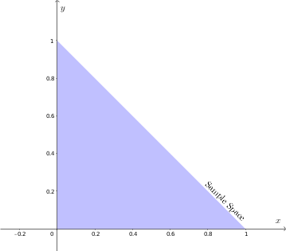
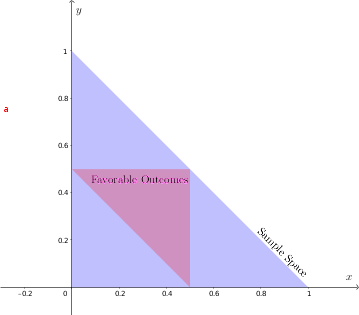

## Monte Carlo Simulation of Randomly Breaking a Stick to form a Triangle

### Problem Statement

**If a stick is broken randomly into three pieces, what is the chance that the three pieces can be used to form a triangle?**

---

### Mathematical Analysis

Since the length of the stick doesn't affect the probability, we set the length as unity: $L=1$.

Let the length of the pieces after breaking the stick be $x$, $y$, and $1-(x+y)$. The quantities $x$ and $y$ are independent and uniformly distributed in $[0,1]$. For the pieces to physically exist, the sum of the first two breaks must be less than the total length:
$$0 < x < 1, \quad 0 < y < 1, \quad 0 < x + y < 1$$

This defines our **Sample Space**, a right-angled triangle in the $xy$-plane with vertices at $(0,0), (1,0),$ and $(0,1)$ depicted in the figure below:

{fig-alt="Sample space" fig-align="center"}

#### The Triangle Inequality
In order for the three lengths to form a triangle, the following must hold:
1. $x + y > 1 - (x + y) \implies x + y > 1/2$
2. $x + (1 - x - y) > y \implies y < 1/2$
3. $y + (1 - x - y) > x \implies x < 1/2$

These inequalities define the **Favorable Outcomes**:
$$0 < x < 1/2, \quad 0 < y < 1/2, \quad 1/2 < x + y < 1$$

{fig-alt="Favourable Outcomes" fig-align="center"}

---

### Interactive Simulation

Below is a live simulation. As the points populate, you will see the blue region (Sample Space) and the red region (Favorable Outcomes) take shape. Notice how the red area occupies exactly $1/4$ of the blue area.

```{python}
#| label: fig-simulation
#| fig-cap: "Watch the Monte Carlo simulation converge to 0.25"

import numpy as np
import matplotlib.pyplot as plt
from matplotlib.animation import FuncAnimation
from matplotlib import rc

# Set up animation to render as interactive JavaScript in the blog
rc('animation', html='jshtml')

def run_stick_simulation(total_frames=60):
    fig, ax = plt.subplots(figsize=(6, 6))
    ax.set_aspect('equal')
    ax.set_xlim(0, 1)
    ax.set_ylim(0, 1)
    ax.set_xlabel("Length of piece 1 (x)")
    ax.set_ylabel("Length of piece 2 (y)")
    
    # Initialize point objects
    sample_points, = ax.plot([], [], 'o', color='blue', markersize=0.8, alpha=0.6, label='Sample Space')
    favorable_points, = ax.plot([], [], 'o', color='red', markersize=0.8, label='Favorable Outcomes')
    ax.legend(loc='upper right')
    
    x_s, y_s = [], []
    x_f, y_f = [], []

    def update(frame):
        # Exponentially increase points per frame for a smooth visual 'reveal'
        points_to_add = int(15 * (1.12**frame))
        
        new_x = np.random.uniform(0, 1, points_to_add)
        new_y = np.random.uniform(0, 1, points_to_add)
        
        for x, y in zip(new_x, new_y):
            z = 1 - (x + y)
            if z > 0: # Inside the sample space
                x_s.append(x)
                y_s.append(y)
                # Check triangle inequality
                if (x + y > z) and (y + z > x) and (z + x > y):
                    x_f.append(x)
                    y_f.append(y)
        
        sample_points.set_data(x_s, y_s)
        favorable_points.set_data(x_f, y_f)
        
        if len(x_s) > 0:
            prob = len(x_f) / len(x_s)
            ax.set_title(f"Simulations: {len(x_s)} | Probability: {prob:.4f}")
        
        return sample_points, favorable_points

    ani = FuncAnimation(fig, update, frames=total_frames, interval=50, blit=True)
    plt.close() # Prevents extra static plot from showing
    return ani

run_stick_simulation()
```

**Conclusion**

As the number of simulations increases, the ratio of red points to blue points converges to 0.25. Geometrically, this is because the favorable region forms a triangle with area $1/8$, while the total sample space triangle has an area of $1/2$.

$$\text{Probability} = \frac{\text{Area(Favorable)}}{\text{Area(Sample)}} = \frac{1/8}{1/2} = \frac{1}{4}$$


